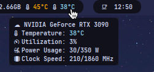
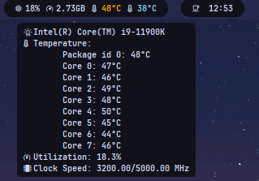
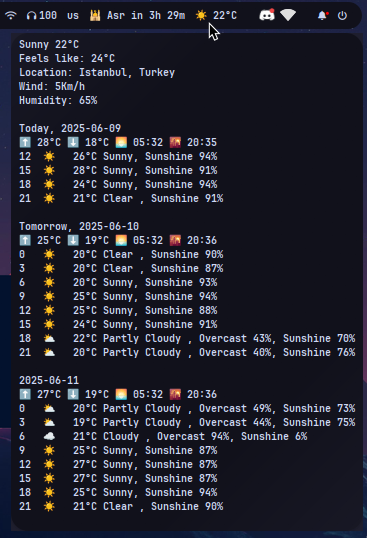
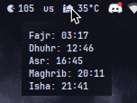

## Modules

All modules output single-line JSON compatible with Waybar's `custom` module interface.

| Module           | Description                                     | Status   | Dependencies |
| ---------------- | ----------------------------------------------- | -------- | ------------ |
| **gpuinfo**      | Shows GPU usage, temperature, clock speed, etc. | ✅ Ready | None         |
| **cpuinfo**      | Shows CPU usage, temperature, clock speed, etc. | ✅ Ready | None         |
| **weather**      | Shows current weather info from the network     | ✅ Ready | None         |
| **prayer_times** | Displays daily prayer times based on region     | ✅ Ready | None         |

### gpuinfo

Displays real-time GPU statistics, including usage, temperature, clock speed, etc.


### cpuinfo

Displays real-time CPU statistics, including usage, frequency, core temperature, etc.


### weather

Fetches weather conditions for your location from wttr.in

To use the module, add these settings to your `~/.local/state/.staterc` file and change them as needed:

```ini
WEATHER_TEMPERATURE_UNIT=c
WEATHER_TIME_FORMAT=24h
WEATHER_WINDSPEED_UNIT=km/h
WEATHER_SHOW_ICON=True
WEATHER_SHOW_LOCATION=False
WEATHER_SHOW_TODAY_DETAILS=True
WEATHER_FORECAST_DAYS=3
WEATHER_LOCATION=Istanbul
```

`WEATHER_TEMPERATURE_UNIT`: Temperature unit, values: `c (Celsius)`, `f (Fahrenheit)`, default: `c`  
`WEATHER_TIME_FORMAT`: Time format, values: `12h`, `24h`, default: `12h`  
`WEATHER_WINDSPEED_UNIT`: Wind speed unit, values: `km/h`, `mph`, default: `km/h`  
`WEATHER_SHOW_ICON`: Show weather icon, values: `true`, `false`, default: `true`  
`WEATHER_SHOW_LOCATION`: Show location name, values: `true`, `false`, default: `false`  
`WEATHER_SHOW_TODAY_DETAILS`: Show detailed weather info for today, values: `true`, `false`, default: `true`  
`WEATHER_FORECAST_DAYS`: Number of forecast days to display, integer (e.g. 3), default: `3`  
`WEATHER_LOCATION`: Location name for weather data in snake_case format, default: `empty`



### prayer_times



Fetches prayer times for your location from aladhan.com

To use the module, add these settings to your `~/.local/state/.staterc` file and change them as needed:

```ini
CITY=Istanbul
COUNTRY_CODE=TR
PRAYER_CALC_METHOD=4
```

`CITY`: City name for prayer times, format: plain text (e.g. Istanbul), default: `empty`  
`COUNTRY_CODE`: Full name of the country where the city is located (e.g. Turkey). default: `empty`
`PRAYER_CALC_METHOD`: Method used for prayer time calculation, format: integer, default: `4 (Umm al-Qura)`

**Available calculation methods:**

- `Jafari / Shia Ithna-Ashari`: `0`
- `University_of_Islamic_Sciences`: `1`
- `Islamic_Society_of_North_America`: `2`
- `Muslim_World_League`: `3`
- `Umm_Al-Qura`: `4`
- `Egyptian_General_Authority_of_Survey`: `5`
- `Institute of Geophysics, University of Tehran`: `7`
- `Gulf_Region`: `8`
- `Kuwait`: `9`
- `Qatar`: `10`
- `Majlis_Ugama_Islam_Singapura`: `11`
- `Union_Organization_Islamic_de_France`: `12`
- `Diyanet_İşleri_Başkanlığı`: `13`
- `Spiritual_Administration_of_Muslims_of_Russia`: `14`
- `Moonsighting_Committee_Worldwide`: `15`
- `Dubai`: `16`
- `Jabatan_Kemajuan_Islam_Malaysia`: `17`
- `Tunisia`: `18`
- `Algeria`: `19`
- `Kementerian_Agama_Republik_Indonesia`: `20`
- `Morocco`: `21`
- `Comunidade_Islamica_de_Lisboa`: `22`
- `Ministry_of_Awqaf`: `23`

---

<div align="center">
    <strong>Check also: <a href="https://github.com/xeyossr/dots">xeyossr/dots</a></strong><br>
    <em>Star ⭐ this repo if you find it useful!</em>
</div>
