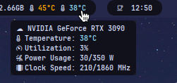
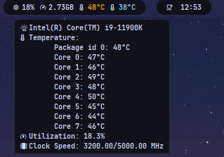
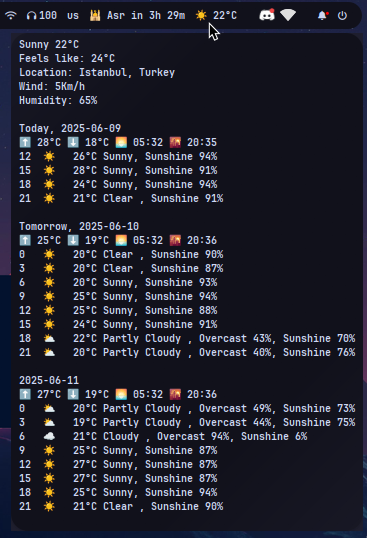

## Modules

All modules output single-line JSON compatible with Waybar's `custom` module interface.

| Module            | Description                                              | Status   | Dependencies     |
| ----------------- | -------------------------------------------------------- | -------- | ---------------- |
| **gpuinfo**       | Shows GPU usage, temperature, clock speed, etc.          | ✅ Ready | None             |
| **cpuinfo**       | Shows CPU usage, temperature, clock speed, etc.          | ✅ Ready | None             |
| **weather**       | Shows current weather info from the network              | ✅ Ready | None             |
| **prayer\_times** | Displays daily prayer times based on region              | ✅ Ready | `python-pytz`    |

### gpuinfo
Displays real-time GPU statistics, including usage, temperature, clock speed, etc.


### cpuinfo
Displays real-time CPU statistics, including usage, frequency, core temperature, etc.


### weather
Fetches weather conditions for your location from wttr.in

To use the module, add these settings to your `~/.local/state/.staterc` file and change them as needed:
```ini
WEATHER_TEMPERATURE_UNIT=c
WEATHER_TIME_FORMAT=24h
WEATHER_WINDSPEED_UNIT=km/h
WEATHER_SHOW_ICON=True
WEATHER_SHOW_LOCATION=False
WEATHER_SHOW_TODAY_DETAILS=True
WEATHER_FORECAST_DAYS=3
WEATHER_LOCATION=Istanbul
```

`WEATHER_TEMPERATURE_UNIT`: Temperature unit, values: `c (Celsius)`, `f (Fahrenheit)`, default: `c`  
`WEATHER_TIME_FORMAT`: Time format, values: `12h`, `24h`, default: `12h`  
`WEATHER_WINDSPEED_UNIT`: Wind speed unit, values: `km/h`, `mph`, default: `km/h`  
`WEATHER_SHOW_ICON`: Show weather icon, values: `true`, `false`, default: `true`  
`WEATHER_SHOW_LOCATION`: Show location name, values: `true`, `false`, default: `false`  
`WEATHER_SHOW_TODAY_DETAILS`: Show detailed weather info for today, values: `true`, `false`, default: `true`  
`WEATHER_FORECAST_DAYS`: Number of forecast days to display, integer (e.g. 3), default: `3`  
`WEATHER_LOCATION`: Location name for weather data in snake_case format, default: `empty`



### prayer_times
Fetches prayer times for your location from aladhan.com

To use the module, add these settings to your `~/.local/state/.staterc` file and change them as needed:
```ini
CITY=Istanbul
COUNTRY_CODE=TR
PRAYER_FORECAST_DAYS=3
PRAYER_CALC_METHOD=Umm_Al-Qura
PRAYER_SHOW_ICON=False
PRAYER_SHOW_TOOLTIP_ICON=False
```

`CITY`: City name for prayer times, format: plain text (e.g. Istanbul), default: `empty`  
`COUNTRY_CODE`: Country code of the city, format: 2-letter ISO code (e.g. TR), default: `empty`  
`PRAYER_FORECAST_DAYS`: Number of days to show prayer times forecast, format: integer (e.g. 3), default: `3`  
`PRAYER_CALC_METHOD`: Method used for prayer time calculation, format: string, default: `Umm_Al-Qura`  
`PRAYER_SHOW_ICON`: Whether to show the icon next to the prayer time text, format: boolean (`True`/`False`), default: `True`
`PRAYER_SHOW_TOOLTIP_ICON`: Whether to show icons inside the tooltip, format: boolean (`True`/`False`), default: `True`

**Available calculation methods:**  
- `Muslim_World_League`  
- `Islamic_Society_of_North_America`  
- `Egyptian_General_Authority_of_Survey`  
- `Umm_Al-Qura`
- `University_of_Islamic_Sciences`  
- `Tehran`  
- `Shia_Ithna-Ashari`  
- `Gulf_Region`  
- `Kuwait`  
- `Qatar`  
- `Majlis_Ugama_Islam_Singapura`  
- `Union_Organization_Islamic_de_France`  
- `Diyanet_İşleri_Başkanlığı`  
- `Spiritual_Administration_of_Muslims_of_Russia`  
- `Moonsighting_Committee_Worldwide`  
- `Dubai`  
- `Jabatan_Kemajuan_Islam_Malaysia`  
- `Tunisia`  
- `Algeria`  
- `Kementerian_Agama_Republik_Indonesia`  
- `Morocco`  
- `Comunidade_Islamica_de_Lisboa`  
- `Ministry_of_Awqaf`

---
<div align="center">
    <strong>Check also: <a href="https://github.com/xeyossr/dots">xeyossr/dots</a></strong><br>
    <em>Star ⭐ this repo if you find it useful!</em>
</div>
